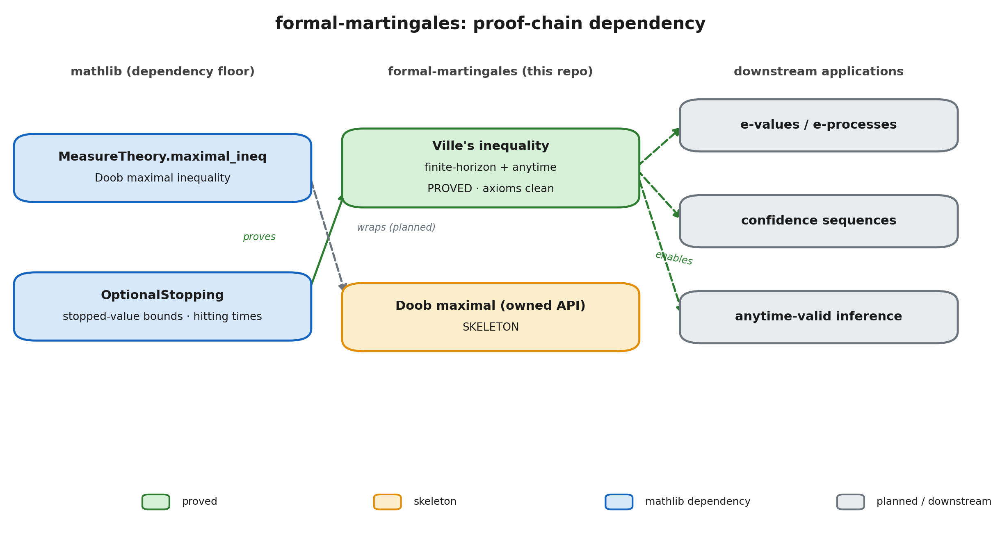

# formal-martingales

[](https://github.com/Robby955/formal-martingales/actions/workflows/ci.yml)
[](lean-toolchain)
[](https://github.com/leanprover-community/mathlib4/tree/25b7ac7d0cf8eef34ced5525f4a62b7613ad649b)
[](LICENSE)

> Classical result: Ville (1939). Lean development maintained under Apache 2.0.
> Author: Rob Sneiderman
> Status: Ville's inequality proved; finite-horizon Doob maximal API proved; concentration and sequential-testing layers planned.

A Lean 4 library for martingale inequalities, anytime-valid inference, and concentration results. It depends on [mathlib](https://github.com/leanprover-community/mathlib4) and builds the supermartingale and time-uniform side of the theory that downstream statistical work needs.

The library imports mathlib's martingale infrastructure (Doob's maximal inequality, optional stopping, conditional expectation) as a dependency and adds the results that sequential analysis and statistical learning theory call for.



## First result: Ville's inequality

For a nonnegative supermartingale `f` adapted to a filtration `𝒢` under a finite measure `μ`, and a level `ε ≥ 0`,

```
ε · μ {ω | ∃ n, ε ≤ f n ω}  ≤  E[f 0].
```

In words: the probability that a nonnegative supermartingale ever reaches level `ε`, at any time, is at most `E[f 0] / ε`. This is the anytime (time-uniform) form. It is the supermartingale dual of Doob's submartingale maximal inequality, and it does not follow by negating Doob, since negating a nonnegative supermartingale gives a submartingale that is no longer nonnegative. The proof goes through optional stopping at the hitting time of the level set, then passes from the finite horizon to the countable horizon.

The probability-normalized corollary is the shape used in sequential testing: if `E[f 0] ≤ 1`, then the event that `f` ever crosses level `α⁻¹` has measure at most `α`. That is the inequality behind e-values, e-processes, and confidence sequences.

See [`docs/ville.md`](docs/ville.md) for the full informal statement and formalization notes, and [`docs/roadmap.md`](docs/roadmap.md) for the planned theorem sequence.

## Status

The repository is honest about what is proved and what is in progress.

- **Proved** (`FormalMartingales/Martingale/Ville.lean`): Ville's inequality in finite-horizon form (`ville_maximal_ineq`) and anytime form (`ville_inequality`), the supporting supermartingale optional-stopping bound (`Supermartingale.expected_stoppedValue_le_start`), and the probability-normalized corollaries (`*_of_integral_le_one`). Every headline declaration reduces to mathlib's standard axiom base only.
- **Proved** (`FormalMartingales/Martingale/Doob.lean`): the finite-horizon Doob maximal API, including the owned wrapper around mathlib's `MeasureTheory.maximal_ineq`, the terminal-expectation bound, `∃ k ≤ n` crossing forms, and probability-normalized corollaries. These declarations have no project-specific axioms.
- **Planned**: time-uniform Azuma-Hoeffding, Freedman / Bernstein anytime bounds, e-values and e-processes, Howard-Ramdas style confidence sequences, and the time-uniform statistical-learning bounds that bridge to [FormalSLT](https://github.com/Robby955/FormalSLT).

## Using the library

A downstream development imports `FormalMartingales` and applies the shipped theorems. The worked file [`examples/EProcessTest.lean`](examples/EProcessTest.lean) derives the type-I error guarantee of an e-process sequential test from Ville's inequality, and a finite-horizon crossing bound from the Doob API:

```lean
import FormalMartingales

open scoped NNReal ENNReal MeasureTheory ProbabilityTheory Topology
open ProbabilityTheory Finset MeasureTheory

variable {Ω : Type*} {m0 : MeasurableSpace Ω} {μ : Measure Ω}
  {𝒢 : Filtration ℕ m0} {e : ℕ → Ω → ℝ}

/-- An e-process crosses `α⁻¹` with probability at most `α`, at any stopping rule. -/
theorem eprocess_sequential_test_typeI
    [IsFiniteMeasure μ] [SigmaFiniteFiltration μ 𝒢]
    (hsuper : Supermartingale e 𝒢 μ) (hnonneg : 0 ≤ e)
    (hstart : μ[e 0] ≤ 1) {α : NNReal} (hα : 0 < α) :
    μ {ω | ∃ n : ℕ, ((α⁻¹ : NNReal) : ℝ) ≤ e n ω} ≤ (α : ℝ≥0∞) :=
  ville_inequality_of_integral_le_one hsuper hnonneg hstart hα
```

Check it against the compiled library with `lake env lean examples/EProcessTest.lean`.

## Structure

```
FormalMartingales.lean                  -- top-level module, re-exports the library
FormalMartingales/Martingale/Doob.lean  -- finite-horizon Doob maximal API, proved
FormalMartingales/Martingale/Ville.lean -- Ville's inequality (finite-horizon + anytime, proved)
examples/EProcessTest.lean              -- downstream-consumption example
docs/                                   -- informal notes, roadmap, figures
LICENSE                                 -- Apache 2.0
CITATION.cff                            -- citation metadata
```

All declarations live in the `FormalMartingales` namespace.

## Building

This project pins mathlib to a fixed revision and uses the matching Lean toolchain (`lean-toolchain`). With [`elan`](https://github.com/leanprover/elan) installed:

```bash
lake exe cache get   # fetch prebuilt mathlib oleans
lake build           # build the library
lake env lean examples/EProcessTest.lean   # type-check the example
```

CI runs the same steps on every push to `main` and every pull request, on Linux and macOS.

## Verification

The proved Ville declarations reduce to mathlib's standard axiom base only:

```
#print axioms FormalMartingales.ville_inequality
-- [propext, Classical.choice, Quot.sound]
```

The finite-horizon Doob API has the same axiom footprint. For example:

```
#print axioms FormalMartingales.doob_maximal_ineq_exists_le_of_integral_le_one
-- [propext, Classical.choice, Quot.sound]
```

## Citation

Citation metadata is in [`CITATION.cff`](CITATION.cff). GitHub renders a "Cite this repository" prompt from it.

## License

Apache 2.0. See [`LICENSE`](LICENSE).
