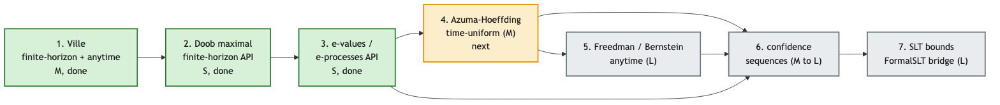

# Roadmap

> Source: theorem-ordering strategy for this library. Author: Rob Sneiderman. Status: planning.

The library grows along one spine: from the maximal inequality for nonnegative supermartingales out to time-uniform concentration and the statistical-learning bounds that consume it. The order below is rough difficulty order. Doob's inequality and optional stopping already live in mathlib and are listed as the dependency floor this library builds on, not as new work.

Difficulty scale: `S` small (days), `M` medium (weeks), `L` large (months).

### 1. Ville's inequality: done

For a nonnegative supermartingale `f` and level `ε > 0`, the probability that `f` ever reaches `ε` is at most `E[f 0] / ε`, uniformly over all time. Finite-horizon and anytime forms, plus the probability-normalized corollaries. Shipped in `FormalMartingales/Martingale/Ville.lean`. Difficulty `M` (complete).

### 2. Doob's maximal inequality: finite-horizon API done

For a nonnegative submartingale, the running maximum satisfies a matching maximal bound (`MeasureTheory.maximal_ineq`). The core theorem already lives in mathlib; `FormalMartingales/Martingale/Doob.lean` wraps it in the owned namespace and proves the terminal-expectation, `∃ k ≤ n`, and probability-normalized finite-horizon forms. Difficulty `S` (complete).

### 3. e-values and e-processes: API done

An e-value is a nonnegative random variable with expectation at most one under the null; an e-process is its sequential version, a nonnegative supermartingale whose initial value is an e-value. Ville's inequality is exactly what makes an e-process a valid sequential test. The current layer defines `EValue` and `EProcess`, proves deterministic-time e-values from an e-process, gives a constructor from the usual supermartingale hypotheses, and proves the test-validity statement on top of the shipped inequality. Shipped in `FormalMartingales/Sequential/EProcess.lean`. Difficulty `S` (complete).

### 4. Optional stopping: mathlib dependency

The expected value of a martingale at a bounded stopping time equals its start; the super/sub versions give inequalities. Already in mathlib (`OptionalStopping`). This library adds the missing supermartingale duals it needs, starting with `Supermartingale.expected_stoppedValue_le_start` (shipped) and continuing toward `expected_stoppedValue_anti` and `stoppedProcess`. Difficulty `S` to `M`.

### 5. Azuma-Hoeffding, time-uniform: next

For a martingale with bounded increments, the deviation of the running sum has a sub-Gaussian tail; composed with Ville, the bound holds at every time at once. The plan routes this through an exponential-supermartingale built from a conditional moment-generating-function hypothesis, then applies Ville to that supermartingale. Difficulty `M`.

### 6. Freedman / Bernstein: major

A time-uniform deviation bound for martingales with bounded increments and controlled predictable variance, sharper than Azuma when the variance is small. The scalar discrete-time case first, stated over the predictable quadratic variation. Difficulty `L`.

### 7. Confidence sequences

A sequence of intervals whose simultaneous coverage holds at every sample size, obtained by inverting an e-process. The core theorem is the coverage guarantee derived from the anytime Ville bound; the interval constructions follow. Difficulty `M` to `L`.

### 8. Statistical-learning bounds

The uniform-convergence and sample-complexity results these inequalities power: time-uniform versions of the Hoeffding and Bennett sample-size bounds that the FormalSLT library states for a fixed horizon. This is the integration boundary where formal-martingales feeds FormalSLT. Difficulty `L`.

## Sequencing note

Items 5 through 8 share one mathematical surface: the exponential supermartingale built from a conditional sub-Gaussian or sub-gamma assumption. Building that object once, then specializing, is the efficient path. Items 3 and 7 are the statistics-facing API; items 5 and 6 are the concentration core; item 8 is the bridge to applied learning-theory bounds.
